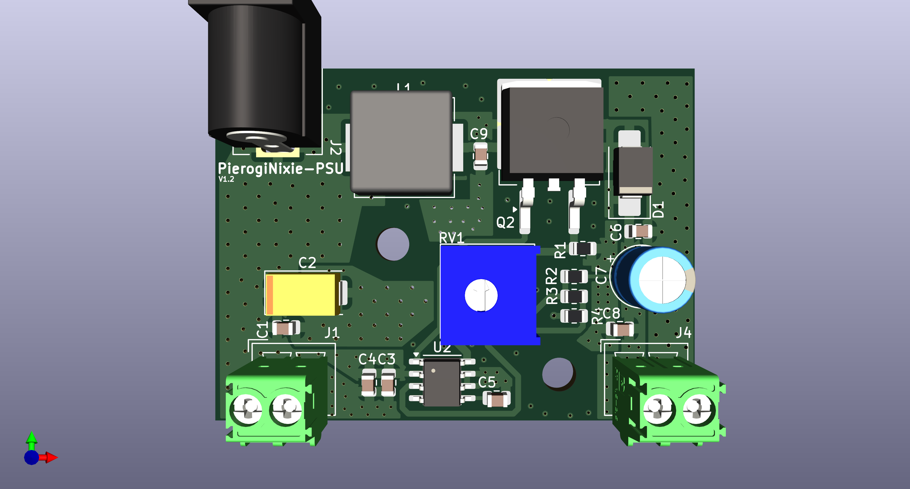
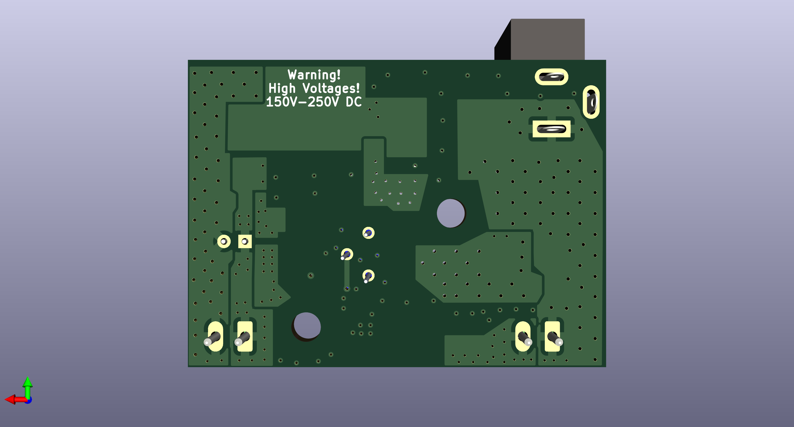
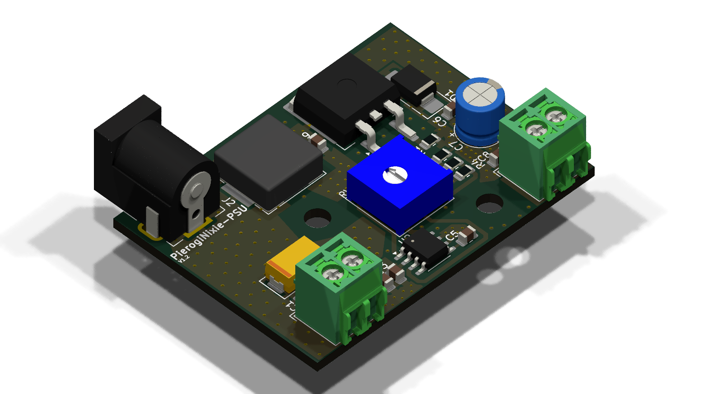

# PierogiNixie-PSU
A simple 12v to 150v-250v DC-DC Power supply for use with nixie tubes.

This is a modified version of an already existing PSU. Link to the original: https://www.electronics-lab.com/project/hv-nixie-dc-dc-switching-power-supply/

## New with V1.2
- Adjustable output AND hardwired resistor options available (150V-250V with variable resistor, 170V with set resistor)
- Cleaner routing
- Power planes
- Updated schematic to be more readable
- Included schematic as PDF
- Smaller Footprint

# Features
- 12v barrel jack input and wire input
- Adjustable output range of 150V to 250V (Only on V1 and V1.2)
- Wire output
- Mounting for M3.5x6 Screw

# Pictures
V1.2 AS OF 1/3/2025

### Front

### Back

### Render

